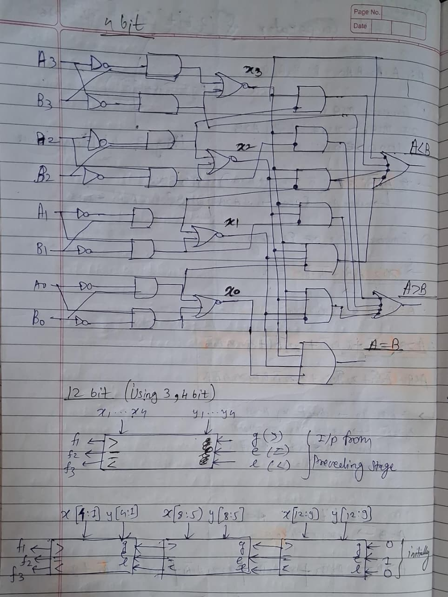
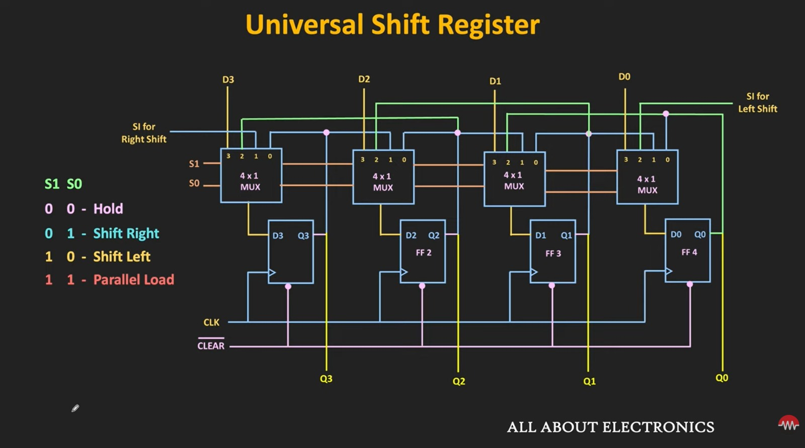
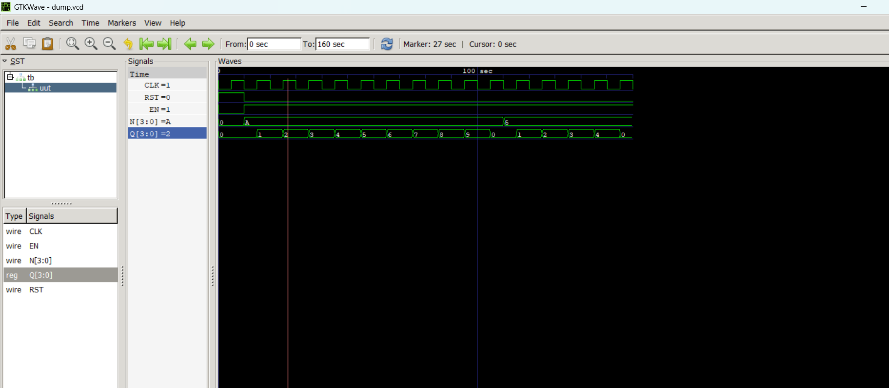

# Verilog RTL Designs

A structured collection of Verilog HDL designs implemented as part of my RTL and Digital Design learning journey.

This repository contains various digital design modules including combinational circuits, arithmetic circuits, sequential circuits, counters, shift registers, and finite state machines (FSMs).

Each project includes:
- Verilog RTL design
- Testbench for verification
- Simulation results
- Circuit diagrams
- Documentation

---

# Repository Structure

```text
Verilog-RTL-Designs/
│
├── 01_Combinational_Circuits
├── 02_Arithmetic_Circuits
├── 03_Sequential_Circuits
└── 04_FSM
```

---

# Topics Covered

## Combinational Circuits
- AND Gate
- BCD to Excess-3 Converter
- Parity Generator
- Comparator
- Multiplexer
- Priority Encoder
- Decoder

---

## Arithmetic Circuits
- Half Adder
- Full Adder
- Ripple Carry Adder
- Carry Lookahead Adder
- Adder Subtractor

---

## Sequential Circuits
- SR Flip-Flop
- JK Flip-Flop
- D Flip-Flop
- T Flip-Flop
- Shift Registers
- Counters
- LFSR Counter

---

## Finite State Machines (FSM)
- Mealy Sequence Detector
- Moore Sequence Detector

---

# Tools Used

- Verilog HDL
- Icarus Verilog
- GTKWave
- VS Code

---

# Key Learning Outcomes

Through these projects, I gained hands-on experience in:
- RTL Design
- Verilog HDL Coding
- Testbench Development
- Digital Logic Design
- Sequential Circuit Design
- FSM Design
- Simulation and Verification

---

# Project Highlights

## 4-bit Comparator Logic Diagram



---

## Universal Shift Register



---

## Synchronous MOD-N Counter Waveform



---

# Author

Pranav Joshi

---